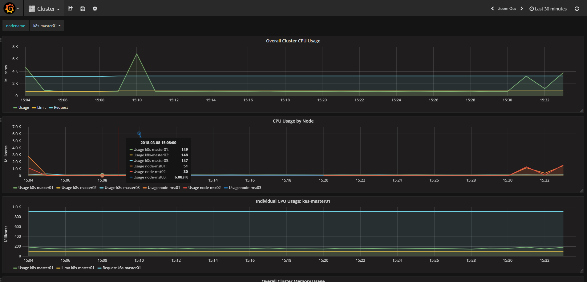

# k8s-cluster

文章旨在介绍使用**kubeadm**建立的multi master kubernetes集群。

- [k8s-cluster](#k8s-cluster)
  - [1. 基础环境](#1-%E5%9F%BA%E7%A1%80%E7%8E%AF%E5%A2%83)
    - [1.1. 镜像列表](#11-%E9%95%9C%E5%83%8F%E5%88%97%E8%A1%A8)
  - [2. 系统预设(所有节点包括master和node)](#2-%E7%B3%BB%E7%BB%9F%E9%A2%84%E8%AE%BE%E6%89%80%E6%9C%89%E8%8A%82%E7%82%B9%E5%8C%85%E6%8B%ACmaster%E5%92%8Cnode)
    - [2.1. 安装Docker-ce](#21-%E5%AE%89%E8%A3%85docker-ce)
    - [2.2. 安装Cluster所需的必要镜像](#22-%E5%AE%89%E8%A3%85cluster%E6%89%80%E9%9C%80%E7%9A%84%E5%BF%85%E8%A6%81%E9%95%9C%E5%83%8F)
    - [2.3. 安装kubernetes集群所需的相关组件](#23-%E5%AE%89%E8%A3%85kubernetes%E9%9B%86%E7%BE%A4%E6%89%80%E9%9C%80%E7%9A%84%E7%9B%B8%E5%85%B3%E7%BB%84%E4%BB%B6)
    - [2.4. 安装keepalived](#24-%E5%AE%89%E8%A3%85keepalived)
    - [2.5. 生成kubeadm及keepalived配置文件](#25-%E7%94%9F%E6%88%90kubeadm%E5%8F%8Akeepalived%E9%85%8D%E7%BD%AE%E6%96%87%E4%BB%B6)
    - [2.6. 使用容器安装etcd集群](#26-%E4%BD%BF%E7%94%A8%E5%AE%B9%E5%99%A8%E5%AE%89%E8%A3%85etcd%E9%9B%86%E7%BE%A4)
  - [3. MASTER高可用部署](#3-master%E9%AB%98%E5%8F%AF%E7%94%A8%E9%83%A8%E7%BD%B2)
    - [3.1. 查看配置文件kubeadm-init.yaml](#31-%E6%9F%A5%E7%9C%8B%E9%85%8D%E7%BD%AE%E6%96%87%E4%BB%B6kubeadm-inityaml)
    - [3.2. master01节点初始化](#32-master01%E8%8A%82%E7%82%B9%E5%88%9D%E5%A7%8B%E5%8C%96)
    - [3.3. master集群组建](#33-master%E9%9B%86%E7%BE%A4%E7%BB%84%E5%BB%BA)
    - [3.4. 扩展DNS服务](#34-%E6%89%A9%E5%B1%95dns%E6%9C%8D%E5%8A%A1)
    - [3.5. 配置keepalived](#35-%E9%85%8D%E7%BD%AEkeepalived)
    - [3.6. 配置kube-proxy](#36-%E9%85%8D%E7%BD%AEkube-proxy)
  - [4. NODE节点操作](#4-node%E8%8A%82%E7%82%B9%E6%93%8D%E4%BD%9C)
    - [4.1. 加入节点，执行命令](#41-%E5%8A%A0%E5%85%A5%E8%8A%82%E7%82%B9%EF%BC%8C%E6%89%A7%E8%A1%8C%E5%91%BD%E4%BB%A4)
  - [5. 集群看板 KUBE-DASHBOARD](#5-%E9%9B%86%E7%BE%A4%E7%9C%8B%E6%9D%BF-kube-dashboard)
    - [5.1. 看板部署](#51-%E7%9C%8B%E6%9D%BF%E9%83%A8%E7%BD%B2)
    - [5.2. 功能简介](#52-%E5%8A%9F%E8%83%BD%E7%AE%80%E4%BB%8B)
    - [5.3. HEAPSTER部署](#53-heapster%E9%83%A8%E7%BD%B2)
  - [6. 创建ingress-controller，将服务暴露给外部](#6-%E5%88%9B%E5%BB%BAingress-controller%EF%BC%8C%E5%B0%86%E6%9C%8D%E5%8A%A1%E6%9A%B4%E9%9C%B2%E7%BB%99%E5%A4%96%E9%83%A8)
  - [7. EFK日志平台](#7-efk%E6%97%A5%E5%BF%97%E5%B9%B3%E5%8F%B0)
    - [7.1. 部署架构](#71-%E9%83%A8%E7%BD%B2%E6%9E%B6%E6%9E%84)
    - [7.2. 部署配置文件](#72-%E9%83%A8%E7%BD%B2%E9%85%8D%E7%BD%AE%E6%96%87%E4%BB%B6)
      - [部署要点](#%E9%83%A8%E7%BD%B2%E8%A6%81%E7%82%B9)
    - [7.3. 部署](#73-%E9%83%A8%E7%BD%B2)
    - [7.4. 问题与思考](#74-%E9%97%AE%E9%A2%98%E4%B8%8E%E6%80%9D%E8%80%83)
  - [总结](#%E6%80%BB%E7%BB%93)


## 1. 基础环境


* kernel：3.10.0-693.el7.x86\_64
* kubernets：v1.9.2
* etcd: 3.1.11
* docker-ce: 17.03.2   kubeadm支持的最大版本

**注意：** _cluster所有基础组件采用容器化方式建立_

### 1.1. 镜像列表

| 镜像 | 说明 | 强制 | 节点 |
| --- | --- | --- | --- |
| gcr.io/google\_containers/etcd-amd64:3.1.11 | 集群状态存储 | 必要 | master |
| gcr.io/google\_containers/kube-apiserver-amd64:v1.9.2 | Cluster操作核心入口 | 必要 | master |
| gcr.io/google\_containers/kube-controller-manager-amd64:v1.9.2 | 资源对象控制中心 | 必要 | master |
| gcr.io/google\_containers/kube-scheduler-amd64:v1.9.2 | 调度中心 | 必要 | master |
| gcr.io/google\_containers/kube-proxy-amd64:v1.9.2 | 通信与负载均衡 | 必要 | master/node |
| gcr.io/google\_containers/k8s-dns-kube-dns-amd64:1.14.7 | DNS | 可选用其他DNS服务 | master |
| gcr.io/google\_containers/k8s-dns-dnsmasq-nanny-amd64:1.14.7 | DNS | 可选组件，与上一镜像共同使用 | master |
| gcr.io/google\_containers/k8s-dns-sidecar-amd64:1.14.7 | DNS | 可选组件，与上一镜像共同使用 | master |
| gcr.io/google\_containers/pause-amd64:3.0 | POD根容器 | 必要 | master |

## 2. 系统预设(所有节点包括master和node)

1.关闭selinux

```bash
vim /etc/selinux/config
设置SELINUX=DISABLED

设置当前环境生效，执行
setenforce 0
```

2.关闭firewalld（非必要，如果不关闭需要设置开放指定端口，内部使用集群建议关闭

```bash
systemctl disable firewalld && systemctl stop firewalld && systemctl status firewalld
```

3.设置桥接及路由转发的内核参

```bash
cat <<EOF >  /etc/sysctl.d/k8s.conf
net.bridge.bridge-nf-call-ip6tables = 1
net.bridge.bridge-nf-call-iptables = 1
net.ipv4.ip_forward = 1
EOF

sysctl --system
```

4.关闭swap

```bash
swapoff -a

vim /etc/fstab
删除或注释掉
/dev/mapper/centos-swap swap  swap  defaults  0 0

检查swap状态
cat /proc/swaps
```

### 2.1. 安装Docker-ce

**注意：** _所有相关程序均在all\_in\_one路径下_

cd docker-ce

```bash
yum localinstall -y docker-ce-selinux-17.03.2.ce-1.el7.centos.noarch.rpm
yum localinstall -y docker-ce-17.03.2.ce-1.el7.centos.x86_64.rpm
```

**注意：** _由于docker-ce默认的cgroups与kubelet不同，此处修改docker-ce的cgroups_

修改配置文件/usr/lib/systemd/system/docker.service

```bash
 ExecStart=/usr/bin/dockerd  --exec-opt native.cgroupdriver=systemd
```

```bash
systemctl daemon-reload
systemctl enable docker && systemctl start docker && systemctl status docker
```

### 2.2. 安装Cluster所需的必要镜像

**注意** _首先核对镜像列表中的docker images；all\_in\_one包中提供了镜像的tar文件，进入images目录，输入以下命令_

```bash
for image in $PWD/*; do docker load -i ${image} ; done
```

由于国内墙的原因，gcr的镜像无法下载，采用此种方式导入镜像节省时间，本人将在docker hub上提供常用镜像，但下载之后需要使用docker tag为镜像制作适合的标签。

### 2.3. 安装kubernetes集群所需的相关组件

* socat
* kubernetes-cni
* kubelet
* kubectl
* kubeadm

切换至all\_in\_one中kuberpm路径顺序执行下列命令

```bash
rpm -ivh socat-1.7.3.2-2.el7.x86_64.rpm
rpm -ivh kubernetes-cni-0.6.0-0.x86_64.rpm  kubelet-1.9.2-0.x86_64.rpm  kubectl-1.9.2-0.x86_64.rpm
rpm -ivh kubeadm-1.9.2-0.x86_64.rpm

systemctl enable kubelet && systemctl start kubelet && systemctl status kubelet
```

### 2.4. 安装keepalived

```bash
yum install -y keepalived
```

### 2.5. 生成kubeadm及keepalived配置文件

修改all\_in\_one/kubeconfig/create-config.sh相关参数\(每个节点需要独立设置\)

```bash
#!/bin/bash

# 设置本机IP
export K8SHA_IPLOCAL=192.168.2.101

# 设置本地etc节点名，选项： etcd1, etcd2, etcd3
export K8SHA_ETCDNAME=etcd1

# keepalived节点角色, options: MASTER, BACKUP. 
export K8SHA_KA_STATE=MASTER

# 配置keepalived节点优先级, 选项： 120, 110, 100. MASTER must 120
export K8SHA_KA_PRIO=120

# 设置keepalived网络接口名称
export K8SHA_KA_INTF=ens32

#######################################
# all masters settings below must be same
#######################################

# 虚拟IP
export K8SHA_IPVIRTUAL=192.168.2.100

# 第一master节点IP
export K8SHA_IP1=192.168.2.101

# 第二master节点IP
export K8SHA_IP2=192.168.2.102

# 第三master节点IP
export K8SHA_IP3=192.168.2.103

# 第一master节点IP
export K8SHA_HOSTNAME1=master01

# 第二master节点IP
export K8SHA_HOSTNAME2=master02

# 第三master节点IP
export K8SHA_HOSTNAME3=master03

# keepalived 认证字符串
export K8SHA_KA_AUTH=4cdf7dc3b4c90194d1600c483e10ad1d

# kubernetes集群Token，可使用 'kubeadm token generate'创建
export K8SHA_TOKEN=7f276c.0741d82a5337f526

# kubernetes CIDR POD网络
export K8SHA_CIDR=10.244.0.0\\/16
```

执行脚本查看返回结果：

```bash
./create-config.sh

set etcd cluster docker-compose.yaml file success: etcd/docker-compose.yaml
set keepalived config file success: /etc/keepalived/keepalived.conf
Please modify the unicaster_peer zone of keepalived.conf
set kubeadm init config file success: kubeadm-init.yaml
```

**注意** _注释掉keepalived.conf中 unicaster\_peer内的本地IP_

### 2.6. 使用容器安装etcd集群

切换至目录all\_in\_one/kubeconfig/etcd，安装docker-compose

```bash
yum install -y docker-compose

docker-compose up -d

Creating network "etcd_default" with the default driver
Creating etcd
```

检查etcd集群状态

```bash
docker exec etcd etcdctl cluster-health
member 5c3ae860bf582f6 is healthy: got healthy result from http://192.168.2.103:2379
member 34f2bd7b086835b1 is healthy: got healthy result from http://192.168.2.101:2379
member ff513872be3498ec is healthy: got healthy result from http://192.168.2.102:2379
cluster is healthy

docker exec etcd etcdctl member list
5c3ae860bf582f6: name=etcd3 peerURLs=http://192.168.2.103:2380 clientURLs=http://192.168.2.103:2379,http://192.168.2.103:4001 isLeader=false
34f2bd7b086835b1: name=etcd1 peerURLs=http://192.168.2.101:2380 clientURLs=http://192.168.2.101:2379,http://192.168.2.101:4001 isLeader=false
ff513872be3498ec: name=etcd2 peerURLs=http://192.168.2.102:2380 clientURLs=http://192.168.2.102:2379,http://192.168.2.102:4001 isLeader=true
```

---

以下为master节点配置

## 3. MASTER高可用部署

### 3.1. 查看配置文件kubeadm-init.yaml

```yaml
apiVersion: kubeadm.k8s.io/v1alpha1
kind: MasterConfiguration
kubernetesVersion: v1.9.2
networking:
  podSubnet: 10.244.0.0/16
apiServerCertSANs:
- master01
- master02
- master03
- 192.168.2.101
- 192.168.2.102
- 192.168.2.103
- 192.168.2.100
- 127.0.0.1
etcd:
  endpoints:
  - http://192.168.2.101:2379
  - http://192.168.2.102:2379
  - http://192.168.2.103:2379
token: 7f276c.0741d82a5337f526
tokenTTL: "0"
```

### 3.2. master01节点初始化

```bash
kubeadm init --config kubeadm-init.yaml
```

初始化成功你将获得如下反馈信息

```bash
[init] Using Kubernetes version: v1.9.2
[init] Using Authorization modes: [Node RBAC]
[preflight] Running pre-flight checks.
    [WARNING FileExisting-crictl]: crictl not found in system path
[preflight] Starting the kubelet service
[certificates] Generated ca certificate and key.
[certificates] Generated apiserver certificate and key.
[certificates] apiserver serving cert is signed for DNS names [master01 kubernetes kubernetes.default kubernetes.default.svc kubernetes.default.svc.cluster.local master01 master02 master03] and IPs [10.96.0.1 192.168.2.101 192.168.2.101 192.168.2.102 192.168.2.103 192.168.2.100 127.0.0.1]
[certificates] Generated apiserver-kubelet-client certificate and key.
[certificates] Generated sa key and public key.
[certificates] Generated front-proxy-ca certificate and key.
[certificates] Generated front-proxy-client certificate and key.
[certificates] Valid certificates and keys now exist in "/etc/kubernetes/pki"
[kubeconfig] Wrote KubeConfig file to disk: "admin.conf"
[kubeconfig] Wrote KubeConfig file to disk: "kubelet.conf"
[kubeconfig] Wrote KubeConfig file to disk: "controller-manager.conf"
[kubeconfig] Wrote KubeConfig file to disk: "scheduler.conf"
[controlplane] Wrote Static Pod manifest for component kube-apiserver to "/etc/kubernetes/manifests/kube-apiserver.yaml"
[controlplane] Wrote Static Pod manifest for component kube-controller-manager to "/etc/kubernetes/manifests/kube-controller-manager.yaml"
[controlplane] Wrote Static Pod manifest for component kube-scheduler to "/etc/kubernetes/manifests/kube-scheduler.yaml"
[init] Waiting for the kubelet to boot up the control plane as Static Pods from directory "/etc/kubernetes/manifests".
[init] This might take a minute or longer if the control plane images have to be pulled.
[apiclient] All control plane components are healthy after 33.003017 seconds
[uploadconfig] Storing the configuration used in ConfigMap "kubeadm-config" in the "kube-system" Namespace
[markmaster] Will mark node master01 as master by adding a label and a taint
[markmaster] Master master01 tainted and labelled with key/value: node-role.kubernetes.io/master=""
[bootstraptoken] Using token: 7f276c.0741d82a5337f526
[bootstraptoken] Configured RBAC rules to allow Node Bootstrap tokens to post CSRs in order for nodes to get long term certificate credentials
[bootstraptoken] Configured RBAC rules to allow the csrapprover controller automatically approve CSRs from a Node Bootstrap Token
[bootstraptoken] Configured RBAC rules to allow certificate rotation for all node client certificates in the cluster
[bootstraptoken] Creating the "cluster-info" ConfigMap in the "kube-public" namespace
[addons] Applied essential addon: kube-dns
[addons] Applied essential addon: kube-proxy

Your Kubernetes master has initialized successfully!

To start using your cluster, you need to run the following as a regular user:

  mkdir -p $HOME/.kube
  sudo cp -i /etc/kubernetes/admin.conf $HOME/.kube/config
  sudo chown $(id -u):$(id -g) $HOME/.kube/config

You should now deploy a pod network to the cluster.
Run "kubectl apply -f [podnetwork].yaml" with one of the options listed at:
  https://kubernetes.io/docs/concepts/cluster-administration/addons/

You can now join any number of machines by running the following on each node
as root:

  kubeadm join --token 7f276c.0741d82a5337f526 192.168.2.101:6443 --discovery-token-ca-cert-hash sha256:0dc35e4317fbbe3e56eaa538afbbb7a1cbadfb7aec15760f209911354100fc1d
```

依据提示执行下列命令：

```bash
mkdir -p $HOME/.kube
sudo cp -i /etc/kubernetes/admin.conf $HOME/.kube/config
sudo chown $(id -u):$(id -g) $HOME/.kube/config
```

查看master01状态

```bash
kubectl get nodes

NAME       STATUS     ROLES     AGE       VERSION
master01   NotReady   master    4m        v1.9.2


kubectl get pods --all-namespaces

NAMESPACE     NAME                               READY     STATUS    RESTARTS   AGE
kube-system   kube-apiserver-master01            1/1       Running   0          3m
kube-system   kube-controller-manager-master01   1/1       Running   0          3m
kube-system   kube-dns-6f4fd4bdf-tzp28           0/3       Pending   0          4m
kube-system   kube-proxy-zqfhq                   1/1       Running   0          4m
kube-system   kube-scheduler-master01            1/1       Running   0          4m
```

本集群CNI网络使用Flannel，安装calico参见[网络选型测试](网络选型测试.md)

下载Flannel配置文件

```bash
wget  https://raw.githubusercontent.com/coreos/flannel/master/Documentation/kube-flannel.yml

kubectl apply -f kube-flannel.yml

clusterrole "flannel" created
clusterrolebinding "flannel" created
serviceaccount "flannel" created
configmap "kube-flannel-cfg" created
daemonset "kube-flannel-ds" created


kubectl get pods --all-namespaces

NAMESPACE     NAME                               READY     STATUS    RESTARTS   AGE
kube-system   kube-apiserver-master01            1/1       Running   0          18m
kube-system   kube-controller-manager-master01   1/1       Running   0          18m
kube-system   kube-dns-6f4fd4bdf-tzp28           3/3       Running   0          19m
kube-system   kube-flannel-ds-5m5d8              1/1       Running   0          2m
kube-system   kube-proxy-zqfhq                   1/1       Running   0          19m
kube-system   kube-scheduler-master01            1/1       Running   0          18m
```

### 3.3. master集群组建

将master01节点的PKI信息拷贝到master02和master03上

```bash
scp -r /etc/kubernetes/pki master02:/etc/kubernetes/

scp -r /etc/kubernetes/pki master03:/etc/kubernetes/
```

其他master节点加入集群

```bash
kubeadm init --config kubeadm-init.yaml
```

执行提示操作，从master01查看各节点pods

```bash
kubectl get pods -o wide --all-namespaces
NAMESPACE     NAME                               READY     STATUS    RESTARTS   AGE       IP              NODE
kube-system   kube-apiserver-master01            1/1       Running   0          27m       192.168.2.101   master01
kube-system   kube-apiserver-master02            1/1       Running   0          1m        192.168.2.102   master02
kube-system   kube-apiserver-master03            1/1       Running   0          36s       192.168.2.103   master03
kube-system   kube-controller-manager-master01   1/1       Running   0          27m       192.168.2.101   master01
kube-system   kube-controller-manager-master02   1/1       Running   0          1m        192.168.2.102   master02
kube-system   kube-controller-manager-master03   1/1       Running   0          24s       192.168.2.103   master03
kube-system   kube-dns-6f4fd4bdf-tzp28           3/3       Running   0          28m       10.244.0.2      master01
kube-system   kube-flannel-ds-5m5d8              1/1       Running   0          12m       192.168.2.101   master01
kube-system   kube-flannel-ds-kkrmd              1/1       Running   1          1m        192.168.2.103   master03
kube-system   kube-flannel-ds-vx7g6              1/1       Running   1          2m        192.168.2.102   master02
kube-system   kube-proxy-44jsc                   1/1       Running   0          1m        192.168.2.103   master03
kube-system   kube-proxy-9zzzg                   1/1       Running   0          2m        192.168.2.102   master02
kube-system   kube-proxy-zqfhq                   1/1       Running   0          28m       192.168.2.101   master01
kube-system   kube-scheduler-master01            1/1       Running   0          27m       192.168.2.101   master01
kube-system   kube-scheduler-master02            1/1       Running   0          1m        192.168.2.102   master02
kube-system   kube-scheduler-master03            1/1       Running   0          28s       192.168.2.103   master03

kubectl get nodes -o wide --all-namespaces
NAME       STATUS    ROLES     AGE       VERSION   EXTERNAL-IP   OS-IMAGE                KERNEL-VERSION          CONTAINER-RUNTIME
master01   Ready     master    29m       v1.9.2    <none>        CentOS Linux 7 (Core)   3.10.0-693.el7.x86_64   docker://17.3.2
master02   Ready     master    2m        v1.9.2    <none>        CentOS Linux 7 (Core)   3.10.0-693.el7.x86_64   docker://17.3.2
master03   Ready     master    2m        v1.9.2    <none>        CentOS Linux 7 (Core)   3.10.0-693.el7.x86_64   docker://17.3.2
```

修改master节点api-server参数/etc/kubernetes/manifests/kube-apiserver.yaml,指定api-server数量,添加执行参数 - --apiserver-count=3

重启服务，查看集群pods状态

```bash
systemctl restart docker && systemctl restart kubelet

kubectl get pods --all-namespaces -o wide
NAMESPACE     NAME                               READY     STATUS    RESTARTS   AGE       IP              NODE
kube-system   kube-apiserver-master01            1/1       Running   0          16s       192.168.2.101   master01
kube-system   kube-apiserver-master02            1/1       Running   0          2m        192.168.2.102   master02
kube-system   kube-apiserver-master03            1/1       Running   0          2m        192.168.2.103   master03
kube-system   kube-controller-manager-master01   1/1       Running   2          34m       192.168.2.101   master01
kube-system   kube-controller-manager-master02   1/1       Running   2          8m        192.168.2.102   master02
kube-system   kube-controller-manager-master03   1/1       Running   2          7m        192.168.2.103   master03
kube-system   kube-dns-6f4fd4bdf-tzp28           3/3       Running   3          35m       10.244.0.3      master01
kube-system   kube-flannel-ds-5m5d8              1/1       Running   1          19m       192.168.2.101   master01
kube-system   kube-flannel-ds-kkrmd              1/1       Running   2          8m        192.168.2.103   master03
kube-system   kube-flannel-ds-vx7g6              1/1       Running   2          9m        192.168.2.102   master02
kube-system   kube-proxy-44jsc                   1/1       Running   2          8m        192.168.2.103   master03
kube-system   kube-proxy-9zzzg                   1/1       Running   2          9m        192.168.2.102   master02
kube-system   kube-proxy-zqfhq                   1/1       Running   2          35m       192.168.2.101   master01
kube-system   kube-scheduler-master01            1/1       Running   2          35m       192.168.2.101   master01
kube-system   kube-scheduler-master02            1/1       Running   2          8m        192.168.2.102   master02
kube-system   kube-scheduler-master03            1/1       Running   2          7m        192.168.2.103   master03
```

### 3.4. 扩展DNS服务

```bash
kubectl scale --replicas=3 -n kube-system deployment/kube-dns

kubectl get pods --all-namespaces -o wide
NAMESPACE     NAME                               READY     STATUS    RESTARTS   AGE       IP              NODE
kube-system   kube-apiserver-master01            1/1       Running   0          10m       192.168.2.101   master01
kube-system   kube-apiserver-master02            1/1       Running   0          12m       192.168.2.102   master02
kube-system   kube-apiserver-master03            1/1       Running   1          12m       192.168.2.103   master03
kube-system   kube-controller-manager-master01   1/1       Running   2          44m       192.168.2.101   master01
kube-system   kube-controller-manager-master02   1/1       Running   2          18m       192.168.2.102   master02
kube-system   kube-controller-manager-master03   1/1       Running   3          17m       192.168.2.103   master03
kube-system   kube-dns-6f4fd4bdf-7pkwj           3/3       Running   3          7m        10.244.2.2      master03
kube-system   kube-dns-6f4fd4bdf-k7q68           3/3       Running   0          7m        10.244.1.2      master02
kube-system   kube-dns-6f4fd4bdf-tzp28           3/3       Running   3          45m       10.244.0.3      master01
kube-system   kube-flannel-ds-5m5d8              1/1       Running   1          29m       192.168.2.101   master01
kube-system   kube-flannel-ds-kkrmd              1/1       Running   2          18m       192.168.2.103   master03
kube-system   kube-flannel-ds-vx7g6              1/1       Running   2          18m       192.168.2.102   master02
kube-system   kube-proxy-44jsc                   1/1       Running   2          18m       192.168.2.103   master03
kube-system   kube-proxy-9zzzg                   1/1       Running   2          18m       192.168.2.102   master02
kube-system   kube-proxy-zqfhq                   1/1       Running   2          45m       192.168.2.101   master01
kube-system   kube-scheduler-master01            1/1       Running   2          44m       192.168.2.101   master01
kube-system   kube-scheduler-master02            1/1       Running   3          18m       192.168.2.102   master02
kube-system   kube-scheduler-master03            1/1       Running   3          17m       192.168.2.103   master03
```

### 3.5. 配置keepalived

_**注意：本文的部署方案并非完整高可用集群，只有高可用功能未提供负载均衡，真正仅一个工作master其余节点热备.**_

启动keepalived服务,按照上文提示修改配置文件/etc/keepalived/keepalived.conf

```bash
systemctl enable keepalived && systemctl start keepalived && systemctl status keepalived

● keepalived.service - LVS and VRRP High Availability Monitor
   Loaded: loaded (/usr/lib/systemd/system/keepalived.service; enabled; vendor preset: disabled)
   Active: active (running) since Wed 2018-02-14 13:03:47 EST; 4s ago
  Process: 14733 ExecStart=/usr/sbin/keepalived $KEEPALIVED_OPTIONS (code=exited, status=0/SUCCESS)
 Main PID: 14734 (keepalived)
   Memory: 10.1M
   CGroup: /system.slice/keepalived.service
           ├─14734 /usr/sbin/keepalived -D
           ├─14735 /usr/sbin/keepalived -D
           └─14736 /usr/sbin/keepalived -D

Feb 14 13:03:47 master01 Keepalived_vrrp[14736]: VRRP_Script(CheckK8sMaster) succeeded
Feb 14 13:03:48 master01 Keepalived_vrrp[14736]: VRRP_Instance(VI_1) Transition to MASTER STATE
Feb 14 13:03:49 master01 Keepalived_vrrp[14736]: VRRP_Instance(VI_1) Entering MASTER STATE
Feb 14 13:03:49 master01 Keepalived_vrrp[14736]: VRRP_Instance(VI_1) setting protocol VIPs.
Feb 14 13:03:49 master01 Keepalived_vrrp[14736]: Sending gratuitous ARP on ens32 for 192.168.2.100
Feb 14 13:03:49 master01 Keepalived_vrrp[14736]: VRRP_Instance(VI_1) Sending/queueing gratuitous ARPs on ens32 for 192.168.2.100
Feb 14 13:03:49 master01 Keepalived_vrrp[14736]: Sending gratuitous ARP on ens32 for 192.168.2.100
Feb 14 13:03:49 master01 Keepalived_vrrp[14736]: Sending gratuitous ARP on ens32 for 192.168.2.100
Feb 14 13:03:49 master01 Keepalived_vrrp[14736]: Sending gratuitous ARP on ens32 for 192.168.2.100
Feb 14 13:03:49 master01 Keepalived_vrrp[14736]: Sending gratuitous ARP on ens32 for 192.168.2.100
```

### 3.6. 配置kube-proxy

```bash
kubectl edit -n kube-system configmap/kube-proxy
        server: https://192.168.2.100:6443
```

重启kube-proxy

```bash
kubectl get pods --all-namespaces -o wide | grep proxy

kubectl delete pod -n kube-system kube-proxy-XXX
```

## 4. NODE节点操作

### 4.1. 加入节点，执行命令

```bash
kubeadm join --token 7f276c.0741d82a5337f526 192.168.2.100:6443 --discovery-token-ca-cert-hash sha256:0dc35e4317fbbe3e56eaa538afbbb7a1cbadfb7aec15760f209911354100fc1d
```

各node节点修改kubelet配置文件，查看apiserver的地址是否为VIP地址，如果不是使用下面的命令修改，重启服务

```bash
sed -e "s/192.168.2.101:6443/192.168.2.100:6443/g" /etc/kubernetes/bootstrap-kubelet.conf > /etc/kubernetes/bootstrap-kubelet.conf

systemctl restart docker && systemctl restart kubelet
```

## 5. 集群看板 KUBE-DASHBOARD

### 5.1. 看板部署

```bash
kubectl apply -f all_in_one/kubeconfig/dashboard/
```

查看配置文件Service部分

```yaml
kind: Service
apiVersion: v1
metadata:
  labels:
    k8s-app: kubernetes-dashboard
  name: kubernetes-dashboard
  namespace: kube-system
spec:
  type: NodePort
  ports:
  - port: 443
    targetPort: 8443
    nodePort: 30000
  selector:
    k8s-app: kubernetes-dashboard
```

采用NodePort方式将服务暴露出去

```bash
get pods -n kube-system|grep dashboard

kubernetes-dashboard-6f8bfb4cf6-7c2r8   1/1       Running   1          6d
kubernetes-dashboard-6f8bfb4cf6-d82pv   1/1       Running   1          6d
kubernetes-dashboard-6f8bfb4cf6-s5rz4   1/1       Running   6          5d
```

服务启动后我们通过访问 `https://masterIP:30000/`，进入登陆界面


此处采用Token认证的机制，k8s的认证机制将会在Wiki中进行专题讲解

配置文件中我们为dashboard创建了serviceaccount，获取该账户的Token执行如下命令

```bash
kubectl -n kube-system describe secret $(kubectl -n kube-system get secret | grep admin-user | awk '{print $1}')
```
获取到的token填入指定位置登入dashboad


### 5.2. 功能简介
* 查询集群资源状态
* 通过yaml或加载配置文件方式改变集群状态
* 配合heapster提供性能监控功能

### 5.3. HEAPSTER部署
**组成：**
```bash
heapster-grafana-amd64:v4.4.3   #grafana图形展示
heapster-amd64:v1.4.2           #监控采集
heapster-influxdb-amd64:v1.3.3  #监控数据存储
```
根据自身的需要调整配置文件，非功能测试使用时建议为influxdb提供持久化存储

**问题：**
当前系统存在一个问题，已经被系统kill的pod信息仍然会被grafana显示，这是由于grafana选择数据来源错误造成的，本人尚未调试，这一错误造成旧的数据对新数据的干扰，当业务上量后会影响使用效果。

部署方式
```bash
kubectl apply -f all_in_one/kubeconfig/kube-heapster/rbac
kubectl apply -f all_in_one/kubeconfig/kube-heapster/influxdb
```
部署完成后稍等片刻，数据便可以在dashboard面板看到，同时我们可以从grafana看到``http://masterIP:30001`，配置文件中我们为grafana提供了NodePort=30001

grafana已经配置好了两个看板，可以查看pods和node的资源监控情况


## 6. 创建ingress-controller，将服务暴露给外部
关于ingress机制将在wiki中介绍，此处仅介绍部署要点
依顺序执行下列命令创建必要资源
```bash
kubectl apply -f all_in_one/kubeconfig/nginx-controller/namespace.yaml
kubectl apply -f all_in_one/kubeconfig/nginx-controller/default-backend.yaml
kubectl apply -f all_in_one/kubeconfig/nginx-controller/configmap.yaml
kubectl apply -f all_in_one/kubeconfig/nginx-controller/tcp-service-configmap.yaml
kubectl apply -f all_in_one/kubeconfig/nginx-controller/udp-service-configmap.yaml
kubectl apply -f all_in_one/kubeconfig/nginx-controller/rbac.yaml
kubectl apply -f all_in_one/kubeconfig/nginx-controller/with-rbac.yaml
```
服务正常启动后，我们就可以为其他Service创建ingress了。
原理嘛，其实就是nginx，总是nginx，都是nginx所以没啥可说的，只是这个nginx高级在自动生成配置文件。

## 7. EFK日志平台
### 7.1. 部署架构


### 7.2. 部署配置文件
* efk-pv
* efk-pvc
* es-service
* es-statefull
* fluentd-es-configmap
* fluentde-es-ds
* kibana-deployment
* kinaba-service

#### 部署要点

elasticsearch服务采用statefullSet模式部署，这样pod与持久化存储将建立一个一对一的关系，当pod重建后会自动寻找之前挂载的持久化存储。
statefullSet会为副本自动创建编号，请看配置模板中如下内容：

```yaml
volumeMounts:
- name: efk-pv
  subPath: es/data
  mountPath: "/data"
```

常规的卷挂载方式

```yaml
volumeClaimTemplates:
- metadata:
    name: efk-pv
  spec: 
    accessModes: [ "ReadWriteOnce" ]
    resources:
      requests:
        storage: 5Gi
```

非常规的卷挂载声明，该挂载声明`name: efk-pv` + `name: elasticsearch-logging`组成了名为`efk-pv-elasticsearch-logging-0`的PVC，自动挂载到对应的PV中，多副本的情况我们需要手动建立例如`efk-pv-elasticsearch-logging-1`的PVC。

### 7.3. 部署

```bash
kubectl apply -f *.yaml   #省略细节
```

目前使用kubectl proxy，服务通过API REST请求访问

```bash
kubectl proxy --address=0.0.0.0 --api-prefix=/ --accept-hosts='^.*$'
```

该命令通过--api-prefix将所有API REST请求开放，实际使用过程中可根据需要进行访问控制（此种方法绕过了https的证书要求）。
通过如下地址访问kibana 

`http://MasterIP:8001/api/v1/proxy/namespaces/kube-system/services/kibana-logging/app/kibana#`

你将看到


### 7.4. 问题与思考

- 当有大量日志读写的时候fluentd可能会消耗大量的系统资源
- 当fluentd提交的日志超过elasticsearch处理能力的时候，将会出现系统瓶颈，可使用kafka作消息队列，实现削峰填谷

## 总结

至此，集群搭建基本完成，可以满足一般业务需求，关于日志分析系统、helm Chart、JVM监控系统等DevOps重要环节部署


未完待续...