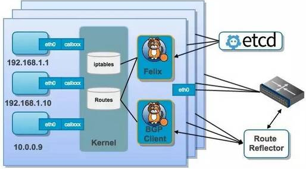
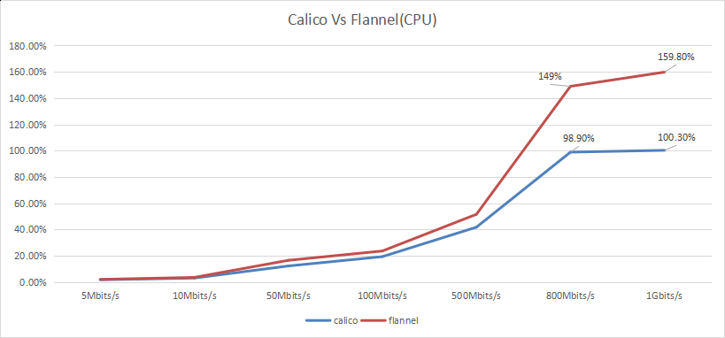

# 容器网络

类比

|                | docker overlay                           | Macvlan                  | Flannel vxlan    | Flannel host-gw  | Weave                                      | Calico                                       |
| -------------- | ---------------------------------------- | ------------------------ | ---------------- | ---------------- | ------------------------------------------ | -------------------------------------------- |
| 网络模型       | overlay Vxlan                            | under lay                | overlay Vxlan    | under lay:3layer | overlay Vxlan                              | under lay:3layer                             |
| 分布式存储支持 | Yes                                      | No                       | Yes              | Yes              | No                                         | Yesc                                         |
| IPAM           | 单一子网                                 | 自定义                   | 每个host一个子网 | 每个host一个子网 | 单一子网                                   | 每个host一个子                               |
| 联通隔离方式   | 网内可通不能跨网，外网通过docker_gwbrige | 自定义二层vlan和路由设定 | 没有隔离         |                  | 可配置不同子网实现隔离，外网通信实用性不强 | 默认只允许通网络互访，可通过策略适应各种场景 |

总体性能:underlay优于overlay，但underlay可能会耗尽物理交换机的mac地址资源

### Calico原理




- 每个host通过使用netfileter实现路由功能
- 无需通过Vxlan封包解包，节约CPU资源，转发性能优越
- 纯三层转发，每个pod都将对应上层交换的MAC表中，可能会耗尽MAC表，需要可信网络支持，外部访问也需要交换机的等设备的支持
- 尽管其支持更为强大的网络策略配置，但是基于netfilter的规则越多，性能会出现明显下降，这一是CNI网络的通病

| CPU使用率 | 5Mbits/s | 10Mbits/s | 50Mbits/s | 100Mbits/s | 500Mbits/s | 800Mbits/s | 1Gbits/s |
| --------- | -------- | --------- | --------- | ---------- | ---------- | ---------- | -------- |
| calico    | 1.80%    | 3.10%     | 12.30%    | 19.40%     | 41.80%     | 98.90%     | 100.30%  |
| flannel   | 2.10%    | 3.60%     | 16.60%    | 23.70%     | 51.60%     | 149%       | 159.80%  |

表中数据可见随着吞吐量增加，CPU负载情况calico明显由于flannel



再看网络延迟的比较结果

| 网络延迟 | 50bytes | 100bytes | 500bytes |
| -------- | ------- | -------- | -------- |
| calico   | 0.0462  | 0.0476   | 0.0518   |
| flannel  | 0.379   | 0.474    | 0.52     |

cc
							

#### calico路由实现

calico会给各个node分配子网，然后在本机添加访问子网的路由，从而实现pod间的路由通信

```bash
[root@k8s-test-master01 ~]# ip route
default via 10.10.3.254 dev eth0  proto static  metric 100                      #默认网关
10.10.0.0/22 dev eth0  proto kernel  scope link  src 10.10.1.201  metric 100    #宿主机网络路由
10.244.17.128/26 via 10.10.1.203 dev tunl0  proto bird onlink                   #访问master03的子网路由
blackhole 10.244.57.192/26  proto bird 
10.244.57.196 dev cali5476079bf60  scope link 
10.244.133.128/26 via 10.10.1.205 dev tunl0  proto bird onlink                  #访问node1的子网路由
10.244.162.192/26 via 10.10.1.204 dev tunl0  proto bird onlink                  #访问noded的子网路由
10.244.198.128/26 via 10.10.1.202 dev tunl0  proto bird onlink                  #访问master02的子网路由
172.17.0.0/16 dev docker0  proto kernel  scope link  src 172.17.0.1 
```

