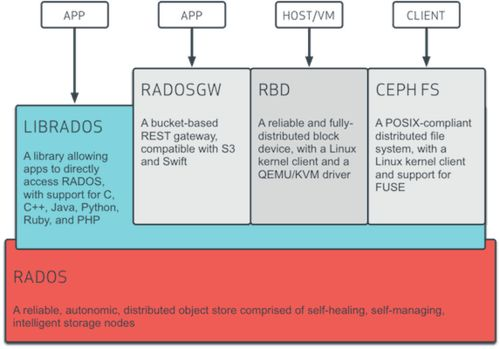

# Ceph基础

## 1. Ceph基础介绍

特点：

* 可靠
* 自恢复
* 自均衡

场景：

* 对象存储
* 块存储
* 文件存储

## 2. Ceph核心组件

* Ceph OSD： 存储、复制、恢复、平衡数据；一般情况下一个硬盘一个OSD也可以是一个分区；Journal盘，用以缓冲写入盘，数据先进入Journal，然后每隔一段时间刷入文件系统，建议使用高读写性能设备，原理就是一种缓冲设备；

* Ceph Monitor：监视集群状态；

* Ceph MDS：保存文件存储服务的元数据，块存储和对象存储不需要。

## 3. Ceph基础架构

从架构图中可以看到最底层的是RADOS，RADOS自身是一个完整的分布式对象存储系统，它具有可靠、智能、分布式等特性，Ceph的高可靠、高可拓展、高性能、高自动化都是由这一层来提供的，用户数据的存储最终也都是通过这一层来进行存储的，RADOS可以说就是Ceph的核心。

RADOS系统主要由两部分组成，分别是OSD和Monitor。

基于RADOS层的上一层是LIBRADOS，LIBRADOS是一个库，它允许应用程序通过访问该库来与RADOS系统进行交互，支持多种编程语言，比如C、C++、Python等。

基于LIBRADOS层开发的又可以看到有三层，分别是RADOSGW、RBD和CEPH FS。

RADOSGW：RADOSGW是一套基于当前流行的RESTFUL协议的网关，并且兼容S3和Swift。

RBD：RBD通过Linux内核客户端和QEMU/KVM驱动来提供一个分布式的块设备。

CEPH FS：CEPH FS通过Linux内核客户端和FUSE来提供一个兼容POSIX的文件系统。

## **4. Ceph数据分布算法**

