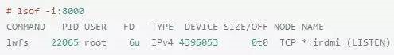
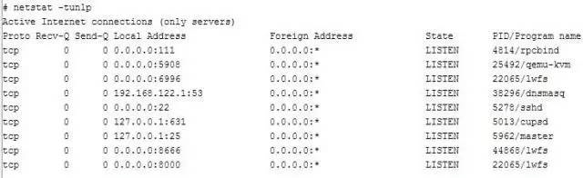
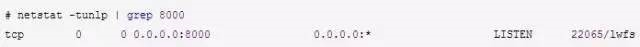
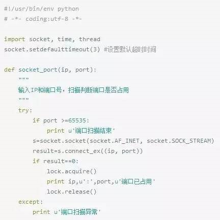
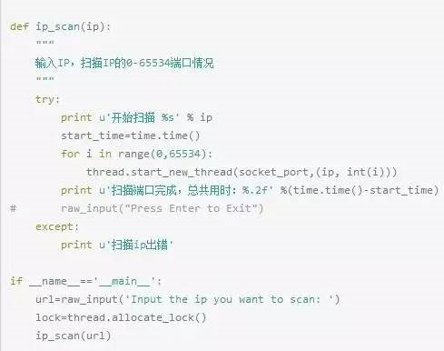
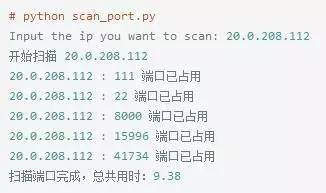

# linux中如何查询端口被占用的情况

今天要使用python写一个端口探测的小程序，以检测一些特定的服务端口有没有被占用，突然发现自己居然不知道在linux中如何查询端口被占用的情况，天呐，赶快学习一下。

***Linux如何查看端口***

1. `lsof -i:端口号` 用于查看某一端口的占用情况，比如查看8000端口使用情况，`lsof -i:8000`

​	可以看到8000端口已经被轻量级文件系统转发服务lwfs占用

2. `netstat -tunlp |grep` 端口号，用于查看指定的端口号的进程情况，如查看8000端口的情况，`netstat -tunlp |grep 8000`

​	说明一下几个参数的含义：

​	附加一个python端口占用监测的程序，该程序可以监测指定IP的端口是否被占用。

​	该程序执行结果如下：

